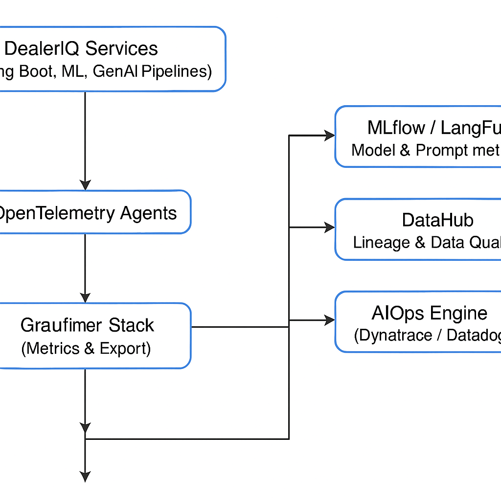

# DealerIQ Observability Framework – DORA Metrics Alignment

## Overview

DealerIQ’s Observability strategy extends traditional DORA metrics beyond software delivery,  
to include **ML/AI/GenAI pipeline performance**, **data reliability**, and **operational resilience**.

It unifies telemetry from:
- **Application services (Spring Boot / Angular)**
- **Event pipelines (Kafka / Flink / Airflow)**
- **ML/GenAI pipelines (MLflow / LangFuse / Helicone)**
- **Ops tooling (Prometheus / Grafana / OpenTelemetry / DataHub)**

This ensures end-to-end visibility, from **dealer interactions → model inference → retraining → redeployment**.



## Core DORA Metrics Adapted for DealerIQ

| **DORA Metric** | **DealerIQ-Specific Interpretation** | **Key Observability KPIs / Sources** |
|-----------------|--------------------------------------|--------------------------------------|
| **Deployment Frequency (DF)** | Measures how often DealerIQ microservices, ML models, and LLM versions are deployed to production. | - ArgoCD / Jenkins pipeline logs  <br> - MLflow registry promotion rate <br> - LLM fine-tuning version logs |
| **Lead Time for Changes (LTC)** | Time from code/model commit → production deployment. Includes data prep and fine-tuning lead time. | - Git commit timestamp <br> - MLflow “train → deploy” latency <br> - Airflow DAG completion times |
| **Change Failure Rate (CFR)** | % of failed releases, model rollbacks, or pipeline errors. | - Argo Rollout rollback events <br> - Kubeflow failed job count <br> - AIOps incident classification |
| **Mean Time to Recovery (MTTR)** | Time to restore service/model after failure or drift detection. | - AIOps RCA duration <br> - Prometheus alert MTTR <br> - Drift detector to retrain-to-deploy lag |

## Observability Domains in DealerIQ

| **Domain** | **Focus Area** | **Key Metrics / Tools** |
|-------------|----------------|--------------------------|
| **App Observability** | Spring Boot, Angular, API Gateway | OpenTelemetry traces, API latency, HTTP 5xx rate |
| **Data Observability** | Data pipelines, feature stores, ingestion quality | Great Expectations, Airflow metrics, DataHub lineage |
| **ML Observability** | Model training, deployment, drift | MLflow metrics, SHAP explainability, EvidentlyAI |
| **GenAI Observability** | Prompt performance, token cost, LLM response quality | LangFuse, Helicone, PromptLayer dashboards |
| **Ops Observability (AIOps)** | Infra, scaling, error anomalies | Prometheus, Grafana, Dynatrace, AlertManager |
| **Cost Observability (FinOps)** | LLM API, GPU, storage, inference | CloudWatch / LangSmith cost metrics |
| **User Experience Observability** | Dealer portal response time, success rate | Frontend APM, Lighthouse CI, HotJar telemetry |

## DealerIQ-Specific Observability KPIs

### Application Metrics
| Metric | Description | Source |
|---------|--------------|--------|
| `api.response.latency_ms` | Time for each REST/gRPC call | OpenTelemetry / Prometheus |
| `dealer.session.duration` | Avg. dealer session length | Angular analytics |
| `order.throughput.rate` | Orders processed per minute | Kafka / Flink |
| `error.5xx.rate` | API errors per 1000 requests | Spring Boot Actuator |
| `frontend.lighthouse.score` | Web performance score | Lighthouse CI |

### DataOps Metrics
| Metric | Description | Source |
|---------|--------------|--------|
| `data.freshness.minutes` | Age of last data update | Airflow DAGs |
| `data.quality.pass_rate` | % of Great Expectations validations passed | Great Expectations |
| `data.lineage.coverage` | % of datasets with lineage metadata | DataHub |
| `pipeline.success_rate` | Successful runs / total runs | Airflow / Argo |
| `schema.drift.count` | Schema deviations per week | Schema Registry |

### MLOps Metrics
| Metric | Description | Source |
|---------|--------------|--------|
| `model.training.duration` | Avg. model training time | MLflow |
| `model.accuracy` | Accuracy / F1 score per model | MLflow, EvalML |
| `model.drift.rate` | Drift events detected | EvidentlyAI |
| `model.retrain.frequency` | Retraining cadence | Kubeflow pipelines |
| `model.rollback.count` | Rollbacks triggered | Seldon / Argo |
| `feature.availability` | % features served successfully | Feast logs |
| `model.latency.ms` | Avg. inference latency | Prometheus + Triton metrics |

### GenAI Observability Metrics
| Metric | Description | Source |
|---------|--------------|--------|
| `llm.prompt.success_rate` | % of prompts that return complete responses | LangFuse |
| `llm.response.latency` | Avg. LLM response time | Helicone |
| `llm.cost.per.token` | Token cost per tenant / dealer | LangSmith |
| `prompt.version.performance` | Performance of prompt template versions | PromptLayer |
| `response.hallucination.rate` | Incorrect or irrelevant outputs | LangFuse QA |
| `feedback.positive.ratio` | Positive dealer feedback post-interaction | RLHF loop metrics |
| `fine_tune.duration` | Avg. time per fine-tuning cycle | MLflow |
| `context.retrieval.accuracy` | RAG grounding success rate | Weaviate / Vector DB logs |

### AIOps & Platform Metrics
| Metric | Description | Source |
|---------|--------------|--------|
| `infra.uptime.percent` | Platform uptime (goal >99.9%) | Prometheus SLA dashboard |
| `incident.count` | Total incidents detected | AIOps correlation engine |
| `mttr.minutes` | Mean Time to Recovery | Dynatrace / PagerDuty |
| `change.failure.rate` | % failed deployments | Argo Rollouts |
| `alert.noise.reduction` | Reduction in duplicate alerts | AlertManager deduplication |
| `autoscaling.trigger.count` | Auto-scale events fired | KEDA / Kubernetes metrics |
| `forecast.error.mae` | Forecast model accuracy over time | MLflow / EvalML |

## Observability Architecture – DealerIQ

```text
+--------------------+
| DealerIQ Services |
| (Spring Boot, ML, |
| GenAI Pipelines) |
+--------------------+
│
▼
[OpenTelemetry Agents]
│
▼
┌─────────────────────┐
│ Prometheus Stack │
│ Metrics & Export │
└─────────────────────┘
│
▼
┌─────────────────────┐
│ Grafana UI │
│ (DORA Dashboards) │
└─────────────────────┘
│
├── MLflow / LangFuse (Model & Prompt metrics)
├── DataHub (Lineage & Data Quality)
└── AIOps Engine (Dynatrace / Datadog)
```

## DORA Observability Dashboard (Example KPIs)

| **Category** | **Metric** | **Goal / Threshold** |
|---------------|-------------|----------------------|
| **Deployment Frequency** | Deployments per week | ≥ 5 |
| **Lead Time for Changes** | Avg. code-to-prod time | ≤ 4 hours |
| **Change Failure Rate** | Failed releases / total | ≤ 10% |
| **MTTR** | Recovery after failure | ≤ 30 min |
| **Model Drift MTTR** | Time from drift → retrain | ≤ 6 hours |
| **Data Pipeline Freshness** | Time since last load | ≤ 15 min |
| **LLM Cost per 1K Tokens** | Avg. across tenants | ≤ $0.05 |
| **Prompt Accuracy** | Pass rate in eval tests | ≥ 90% |
| **Infra Uptime** | Overall system uptime | ≥ 99.9% |
| **Feedback Positivity** | Positive vs total | ≥ 85% |

## Toolchain Integration

| **Category** | **Tool / Platform** | **Integration Purpose** |
|---------------|---------------------|--------------------------|
| **Metrics** | Prometheus / Grafana | System, API, and model metrics |
| **Tracing** | OpenTelemetry / Jaeger | End-to-end distributed tracing |
| **Logging** | ELK Stack | Log aggregation and correlation |
| **ML Metrics** | MLflow / EvalML | Model performance tracking |
| **LLM Metrics** | LangFuse / Helicone | Prompt performance & latency |
| **Data Quality** | Great Expectations | Validation on ingestion |
| **Lineage** | DataHub / Apache Atlas | End-to-end data flow visibility |
| **Ops Intelligence** | Dynatrace / Datadog | Incident correlation & RCA |
| **AIOps** | Custom anomaly models | Predictive alerting and healing |
| **FinOps** | LangSmith / CloudWatch | Cost observability & optimization |

## Summary

DealerIQ’s DORA-aligned Observability Framework delivers:
- **Full lifecycle monitoring** from code → model → inference → feedback.  
- **Unified metrics** across Spring AI, MLflow, and GenAIOps layers.  
- **Predictive reliability** via AIOps integration.  
- **Actionable dashboards** mapping DORA KPIs to model and data quality.  
- **Faster learning cycles**, **lower drift latency**, and **transparent cost governance**.
