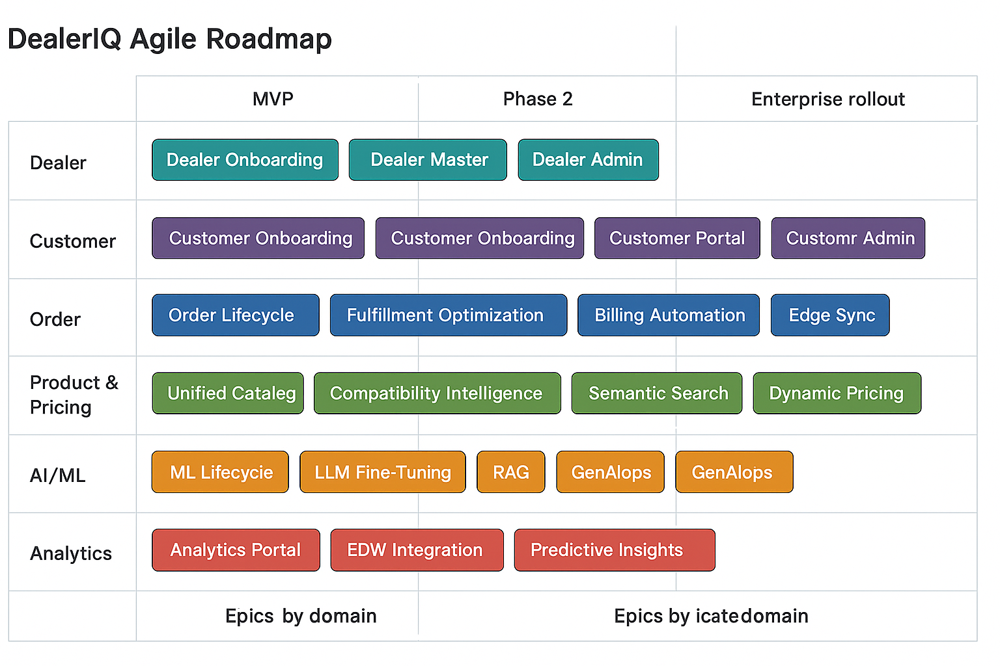

# DealerIQ – Agile Epic → Capability → Feature Hierarchy

## 1. Dealer Domain

| **Epic** | **Capability** | **Feature Examples** |
|-----------|----------------|----------------------|
| Dealer Onboarding & Verification | KYC automation | - Automated dealer registration form - AI-driven risk & eligibility scoring |
|  | Onboarding workflow engine | - Approval hierarchy configuration - Region-based assignment rules |
| Dealer Master & Profile Management | Dealer master data | - Unified dealer record API - Integration with CRM/ERP dealer data |
|  | Dealer hierarchy | - Multi-region dealer tree - Dealer tagging and segmentation |
| Dealer Engagement & Retention Intelligence | Engagement analytics | - Dealer interaction dashboard - Loyalty & churn ML model |
|  | Dealer campaigns | - Personalized retention campaigns - Feedback capture widgets |
| Dealer Pricing & Margin Optimization | ML pricing engine | - Elasticity-based price adjustment - AI-based promotion recommendations |
| Dealer Portal & Dashboard Experience | Angular UI | - Dealer KPIs dashboard - Chat Copilot integration |
| Dealer Support Automation | AI support assistant | - LLM-based ticket summarizer - Knowledge base auto-suggestions |
| Dealer Admin Portal | Admin dashboards | - Territory management - Regional dealer analytics and alerts |

## 2. Customer Domain

| **Epic** | **Capability** | **Feature Examples** |
|-----------|----------------|----------------------|
| Customer Onboarding & Profiling | Smart onboarding | - Document upload & verification - Onboarding success scoring |
| Customer 360 & Loyalty Management | Customer data hub | - Unified customer profile view - Purchase history & satisfaction index |
| Customer Portal Experience | Product discovery | - AI-assisted product finder - Order history visualization |
|  | Self-service tools | - Order tracking - Warranty status lookup |
| Customer Support AI Copilot | LLM-driven chat | - AI-assisted customer Q&A - Auto ticket generation |
| Customer Admin Portal | CRM integration | - Region-based customer reporting - Sentiment heatmap dashboard |

## 3. Product & Pricing Domain

| **Epic** | **Capability** | **Feature Examples** |
|-----------|----------------|----------------------|
| Unified Product Catalog & Search | Catalog API | - Cross-brand SKU normalization - Semantic search engine |
| Product Compatibility & Substitution Intelligence | Graph reasoning | - Compatibility relationships - Alternative product suggestions |
| Dynamic Pricing Engine | ML pricing API | - Elasticity model service - Auto-margin optimization |
| Product Visual Recognition | Computer vision | - Image upload search - Part recognition by photo |
| Promotion & Campaign Personalization | AI campaign service | - Personalized offers - Promotion ROI tracker |

## 4. Order Management Domain

| **Epic** | **Capability** | **Feature Examples** |
|-----------|----------------|----------------------|
| Unified Order Lifecycle Management | Order orchestration | - Dealer–customer linking - Multi-service order state tracking |
| Order Fulfillment Optimization | Smart logistics | - Delivery route optimization - Inventory balancing logic |
| Billing & Reconciliation Automation | Auto invoicing | - Invoice generator - Anomaly detection for billing |
| Edge Sync & Offline Operations | Edge runtime | - Local caching for offline mode - Sync service with MQTT |
| Order Insights & Forecasting | Predictive analytics | - Order pattern forecasting - AI-based anomaly detection |

## 5. Analytics & Intelligence Domain

| **Epic** | **Capability** | **Feature Examples** |
|-----------|----------------|----------------------|
| Analytics Portal Implementation | Angular analytics UI | - Unified BI dashboard - AI summary generation |
| EDW & Data Lake Integration | Data pipeline orchestration | - dbt model lineage - Data freshness monitor |
| Predictive & Prescriptive Insights | ML visualization | - KPI prediction charts - Auto recommendations |
| Executive KPI Dashboards | BI storytelling | - AI-generated executive summaries - Dynamic what-if analytics |
| DataOps Observability | Data health metrics | - Schema drift alerts - Pipeline SLA dashboards |

## 6. AI / ML / GenAI Domain

| **Epic** | **Capability** | **Feature Examples** |
|-----------|----------------|----------------------|
| ML Model Lifecycle & MLOps Automation | Continuous training | - Auto retraining scheduler - Drift detection service |
| DealerIQ-LLM Fine-Tuning & Domain Adaptation | Fine-tuning studio | - LoRA adapter manager - Domain corpus loader |
| RAG & Contextual Reasoning | Hybrid retrieval | - Neo4j graph connector - Vector DB query orchestrator |
| RLHF Feedback System | Feedback ingestion | - LangFuse integration - Feedback-to-train pipeline |
| GenAIOps & Prompt Governance | Prompt registry | - Prompt version control - Cost optimization metrics |
| Voice & Vision Multimodal AI | Multimodal APIs | - Whisper speech recognition - CLIP/BLIP image embeddings |
| AI Orchestration Layer (Spring AI + LangChain4j) | Model router | - Multi-model routing rules - Failover & fallback handling |

## 7. Data & Integration Domain

| **Epic** | **Capability** | **Feature Examples** |
|-----------|----------------|----------------------|
| Data Ingestion & Harmonization | Connectors | - ERP/CRM data ingestion - Supplier feed ETL pipelines |
| Data Governance & Lineage | Data catalog | - Metadata management (DataHub) - Policy compliance monitor |
| Feature Store & Metadata Management | Feature registry | - Reusable ML feature versioning - Feature lineage view |
| ETL / ELT Automation | Transformation pipelines | - dbt + Airbyte jobs - Schema harmonization scripts |
| Real-Time Streaming Architecture | Kafka eventing | - Schema Registry - DLQ and replay tools |

## 8. Support & Operations Domain

| **Epic** | **Capability** | **Feature Examples** |
|-----------|----------------|----------------------|
| Dealer Support Portal | Chat + case system | - AI ticket generator - Dealer-specific issue tagging |
| Customer Support Portal | Chat + ticketing | - GenAI triage - Contextual resolution assistant |
| AI Copilot for Support Agents | Real-time copilot | - Suggested responses - Case summary builder |
| Knowledge Base Automation | Document synthesis | - FAQ auto-generation - Support doc embeddings |
| Support Analytics & Feedback Integration | Insight dashboards | - Resolution time trends - Support satisfaction index |

## 9. Admin & Security Domain

| **Epic** | **Capability** | **Feature Examples** |
|-----------|----------------|----------------------|
| Multi-Tenant Admin Console | Admin console UI | - Tenant configuration page - Usage metrics view |
| Role-Based Access & Keycloak Integration | IAM control | - SSO integration - Role-based policies |
| Security, Compliance, & Guardrails | AI moderation | - Guardrails.ai rules - PII masking engine |
| API Gateway & Rate Limiting | Gateway enforcement | - Throttling middleware - JWT validation layer |
| Audit Logging & Governance Reports | Compliance tools | - Activity audit reports - Exportable compliance logs |

## 10. Observability & Cloud Operations Domain

| **Epic** | **Capability** | **Feature Examples** |
|-----------|----------------|----------------------|
| Observability & DORA Metrics Framework | Monitoring dashboards | - Prometheus metrics exporter - Grafana visualization |
| AIOps Incident Automation | Incident management | - Anomaly detector - Root-cause summarization LLM |
| Model & LLM Observability | Model metrics | - Token usage dashboard - Drift trend analytics |
| Cost & Performance Optimization | Cloud governance | - API cost tracking - GPU utilization metrics |
| CI/CD Pipelines & Helm Deployment | Continuous delivery | - GitHub Actions workflow - Helm chart deployment automation |

## 11. Analytics & Reporting Extensions

| **Epic** | **Capability** | **Feature Examples** |
|-----------|----------------|----------------------|
| DealerIQ Analytics Portal | Unified analytics | - AI + ML + GenAI dashboards - EDW + Data Lake explorer |
| Automated BI Report Generation | Natural language BI | - LLM-driven summaries - Report scheduling |
| Predictive Business Storytelling | AI narrative | - Executive summary generator - KPI explanation assistant |
| Executive Decision Assistant | Simulation engine | - “What-if” model - Forecast comparison visualizer |

## Summary

- **Epics:** 65  
- **Capabilities:** ~80  
- **Features:** 200+ (expandable into user stories)
- **Structure:** Business-aligned → Technology-implementable  
