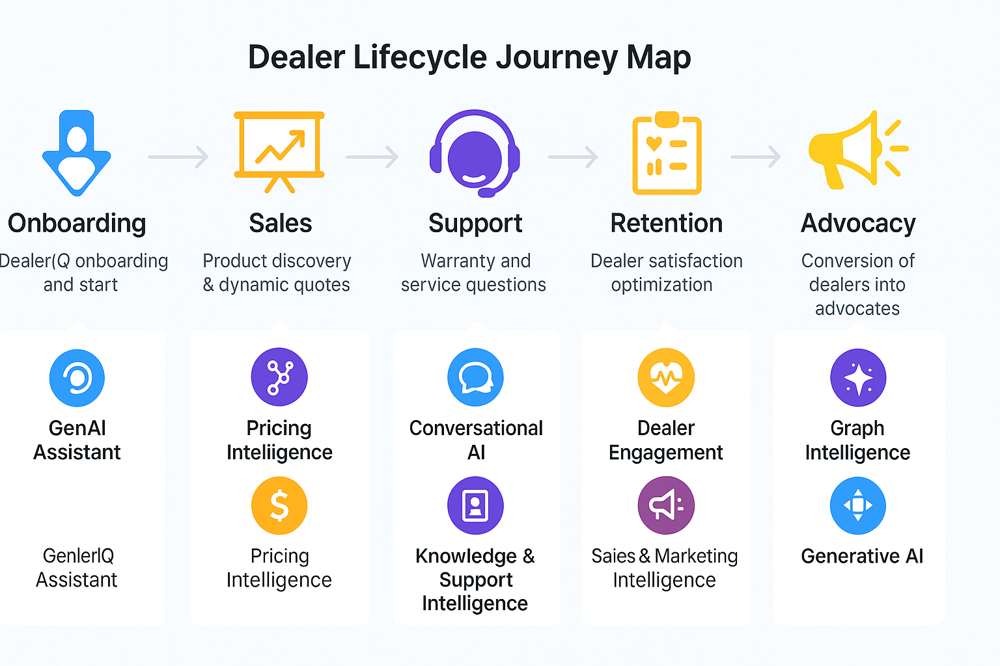
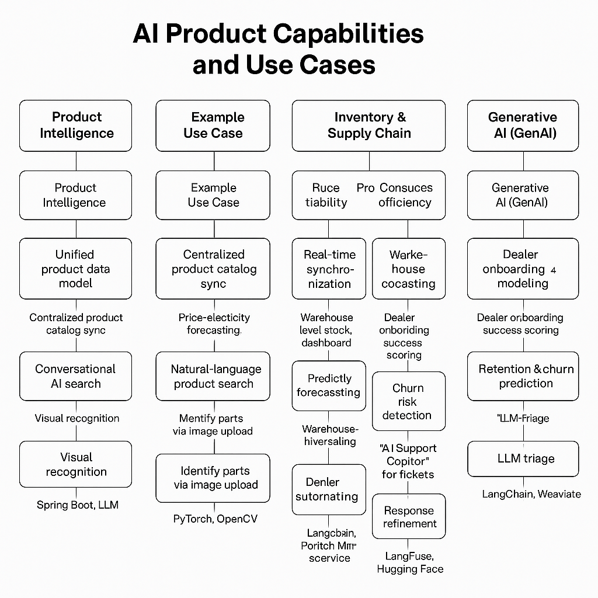

# Intelligence Suite: DealerIQ – Product Requirements Document (PRD)

**Version:** 1.0  

## Disclaimer

This document presents **DealerIQ**, a flagship conceptual product within the *Intelligence Suite* initiative.  
It is a **forward-looking innovation framework** designed to illustrate how AI, ML, and GenAI technologies can redefine dealer and distribution ecosystems.

DealerIQ combines **Angular-based intelligent UX**, **microservices**, **vector & graph data intelligence**, **fine-tuned LLMs**, and **enterprise-grade MLOps/AIOps/GenAIOps pipelines** to deliver next-generation dealer enablement.

This document is **not a finalized or released product**, but rather a **comprehensive reference architecture and requirement framework** for research, prototyping, and investment evaluation.

## Understanding the Dealer Ecosystem

### Who is a Dealer?

A **Dealer** represents a key business intermediary between **manufacturers (OEMs)** and **end customers** — often operating in industries such as **machinery, automotive, heavy equipment, and industrial parts**.  
Dealers purchase, stock, promote, and sell manufacturer products to regional customers, while managing after-sales service, warranty, and support.

Dealers face the challenge of balancing **inventory visibility**, **pricing competitiveness**, **product knowledge**, and **customer satisfaction**, often across multiple suppliers and regions.  
The **DealerIQ Intelligence Suite** is designed to **empower dealers and distributors** through AI-driven insights, automation, and collaboration tools.

### Dealer Ecosystem Overview

| **Entity / Role** | **Description** | **Core Responsibilities** | **Pain Points (Pre-AI)** | **DealerIQ Value Proposition** |
|--------------------|-----------------|-----------------------------|---------------------------|-------------------------------|
| **Dealer / Distributor** | Authorized seller of OEM/manufacturer products | Inventory, sales, promotions, customer support | Manual price updates, poor visibility into stock, inconsistent product info | Real-time pricing & inventory visibility, AI-driven recommendations |
| **OEM / Manufacturer** | Producer of machinery, components, and accessories | Production, logistics, warranty | Low dealer feedback visibility, inefficient promotion ROI tracking | Predictive analytics, dealer engagement intelligence |
| **Regional Manager / Territory Head** | Oversees multiple dealers in a region | Sales tracking, performance management | Disparate dealer data, reactive forecasting | Centralized dashboards, predictive sales KPIs |
| **Field Sales Representative** | On-ground product specialist supporting dealers | Quote generation, sales visits | Time-consuming quote preparation, manual data lookup | AI quote generation, product recommendation engine |
| **Customer / End User** | Purchases or operates the product | Buying decision, service requests | Confusion due to incomplete product info | Personalized product search, conversational assistant |
| **Supplier / OEM Partner** | Supplies materials or parts to dealers | Fulfillment, product updates | Fragmented demand visibility | Real-time demand signals from dealers |
| **Support / Service Agent** | Handles warranty and post-sale support | Ticket management, issue resolution | Manual document lookup, delayed triage | LLM-based issue summarization, automatic solution retrieval |

### Why Dealers Need an Intelligence Suite

| **Dealer Business Challenge** | **Traditional Limitation** | **AI / ML / GenAI Solution (DealerIQ)** |
|--------------------------------|-----------------------------|------------------------------------------|
| Fragmented product & pricing data across brands | Disconnected ERP/CRM systems | Unified data model + AI product discovery |
| Reactive demand forecasting | Spreadsheet-based manual planning | Predictive inventory optimization |
| Delayed quote and sales response | Manual approval processes | Dynamic AI-driven quote generation |
| Poor customer satisfaction tracking | Static surveys, no sentiment analysis | Sentiment classification & dealer engagement scoring |
| Limited visibility into promotion ROI | Manual campaign tracking | AI-based ROI forecasting and personalization |
| Inconsistent after-sales service quality | Unstructured ticket data | LLM-powered issue triage & resolution summaries |
| Lack of dealer training & product literacy | Overwhelming manuals and technical docs | GenAI-driven training assistant and summaries |
| High operational costs | Redundant coordination efforts | End-to-end automation and intelligent workflows |

### DealerIQ Business Unit Framework Overview

| **Business Unit** | **Purpose** | **Primary Beneficiaries** | **AI/ML/GenAI Focus** |
|--------------------|-------------|----------------------------|------------------------|
| **Product Intelligence** | Unify product data and enable discovery | Dealers, OEMs | RAG, embeddings, graph intelligence |
| **Pricing Intelligence** | Optimize pricing strategies dynamically | Dealers, Finance Teams | Elasticity models, reinforcement learning |
| **Inventory & Supply Chain** | Ensure stock optimization and visibility | Dealers, Supply Chain Managers | Time-series forecasting, demand prediction |
| **Dealer Engagement** | Enhance dealer satisfaction and retention | Regional Managers, CRM | Sentiment analysis, churn models |
| **Sales & Marketing Intelligence** | Drive revenue through data-driven campaigns | Marketing Teams | Predictive ROI analytics, GenAI content |
| **Knowledge & Support Intelligence** | Improve support efficiency and training | Dealers, Service Agents | LLM summarization, auto-documentation |
| **Data Intelligence Layer** | Enable high-quality data flow and lineage | DataOps, IT Admins | Great Expectations, DataHub, Schema Registry |
| **AI/ML Lifecycle (MLOps)** | Manage AI/ML model lifecycle and governance | Data Scientists, MLOps Engineers | MLflow, Kubeflow, Drift Detection |
| **Generative AI (GenAI)** | Empower conversation, summarization, and automation | Dealers, Managers, Executives | Fine-tuning, RAG, RLHF, Persona adaptation |
| **Observability & Ops Intelligence** | Ensure performance, reliability, and insight | DevOps, AIOps Teams | DORA metrics, AIOps anomaly detection |
| **Cloud & Infrastructure** | Provide deployment scalability and security | DevOps, Admin Teams | Kubernetes, Keycloak, ArgoCD, Istio |

### Summary

Dealers operate in a **data- and relationship-intensive environment** where each decision—from pricing to inventory to engagement—directly impacts business outcomes.  
The **DealerIQ Intelligence Suite** brings **AI, ML, and GenAI** capabilities into these workflows,  
transforming dealers into **intelligent, data-driven business ecosystems** with predictive and generative capabilities at every layer.

# DealerIQ Enterprise Alignment Matrix

A cross-domain view connecting **business functions**, **data assets**, **AI-powered services**, and **personas** across the Intelligence Suite.

| **Business Unit** | **Key Data Sets** | **Key Personas (Customer / Admin / Partner / Supplier)** | **Business Service(s)** | **Input** | **Output** | **Use Case Description** |
|--------------------|------------------|-----------------------------------------------------------|--------------------------|------------|-------------|---------------------------|
| **Dealer Management** | Dealer Master, Dealer Region, Dealer Activity Logs, CRM Integration Data | Dealers, Regional Managers, HQ Admins | Dealer Onboarding, Profile Management, Engagement Tracking | Dealer registration forms, CRM feed | Dealer profiles, engagement dashboards | Centralizes dealer information and lifecycle tracking; monitors dealer activity and loyalty. |
| **Product & Catalog Intelligence** | Product Master, SKU Specs, Supplier Feeds, Product Images, Compatibility Data | Dealers, Product Managers, Suppliers | Product Catalog, Visual Part Recognition, Compatibility Graphs | ERP and OEM feeds, uploaded catalogs | Searchable catalog, AI product recommendations | Unifies product data across OEMs; enables visual and semantic product discovery. |
| **Inventory & Supply Chain** | Inventory Snapshots, Warehouse Data, Reorder Thresholds, Stock Movement Logs | Dealers, Warehouse Admins, Supply Chain Managers | Real-Time Stock Visibility, Replenishment Forecasting | Stock feeds, ERP signals | Stock dashboards, reorder suggestions | Provides real-time inventory visibility and proactive restocking recommendations. |
| **Pricing & Revenue Management** | Price Lists, Dealer Discounts, Currency Rates, Promotions, Sales Orders | Dealers, Pricing Analysts, HQ Admins | Dynamic Pricing, Promotion Optimization, Margin Analysis | Product and dealer data, price history | Optimized pricing suggestions, ROI reports | Machine learning-driven price optimization and promotion effectiveness tracking. |
| **Order & Fulfillment** | Orders, Invoices, Shipments, Payments, Returns | Dealers, Order Managers, Finance Team | Order Placement, Tracking, and Fulfillment Management | Dealer order inputs, product data | Order confirmations, shipment updates | Enables seamless order lifecycle management from dealer request to delivery. |
| **Dealer Support & Service** | Support Tickets, Knowledge Base, Warranty Logs, Chat Logs | Dealers, Support Agents, AI Assistant, Service Admins | Conversational Support, Issue Triage, Knowledge Search | Dealer queries, support forms | AI responses, resolutions, summarized tickets | Provides 24/7 dealer assistance using LLMs for triage and technical Q&A. |
| **Dealer Feedback & Engagement** | Feedback Forms, Chat Sentiments, Interaction Logs | Dealers, Feedback Analysts, Model Trainers | Feedback Capture, RLHF Processing, Sentiment Analytics | Dealer feedback messages | Sentiment metrics, RLHF training data | Captures and analyzes feedback to improve AI models and dealer satisfaction. |
| **Promotion & Campaigns** | Promotion Schedules, Campaign ROI, Dealer Engagement Metrics | Marketing Managers, Dealers, Regional Admins | Promotion Engine, Personalization System | Product and regional sales data | Dealer-specific campaign offers | Personalizes promotional content based on dealer performance and interests. |
| **Forecasting & Analytics** | Forecast Models, Historical Sales, Demand Signals, ML Metrics | Data Scientists, Regional Managers, HQ Planners | Predictive Forecasting, KPI Dashboards | Transaction data, model inputs | Sales forecasts, anomaly alerts | Predicts demand, detects trends, and powers decision intelligence dashboards. |
| **LLM Orchestration & GenAI** | Prompts, Embeddings, Context Logs, LLM Responses | Dealers, AI Orchestrator, GenAI Engineers | Conversational AI, RAG Grounding, Summarization | Dealer prompts, product documents | AI-generated responses, summaries | Enables natural language interactions for product lookup, pricing, and service help. |
| **Fine-Tuning & Model Management** | Model Weights, Training Data, MLflow Runs, Evaluation Metrics | AI Engineers, MLOps Admins | Model Training, Fine-Tuning, Registry Management | Datasets, training configuration | Fine-tuned models, evaluation reports | Automates ML/GenAI lifecycle for continuous improvement. |
| **Embeddings & Knowledge Graph** | Text Embeddings, Graph Links, Product Relations | Data Scientists, AI Orchestrator | Vectorization, Graph Reasoning | Manuals, catalogs, chat transcripts | Vector DB indexes, relationship maps | Enables semantic search, contextual RAG retrieval, and reasoning. |
| **DataOps** | Raw Data, dbt Models, Metadata, Quality Reports | Data Engineers, Data Stewards | Data Validation, Transformation, Lineage Tracking | Ingested raw feeds | Cleaned and validated datasets | Ensures high-quality, lineage-aware data for analytics and AI pipelines. |
| **MLOps** | Model Metadata, Feature Store, Drift Metrics, Pipeline Logs | MLOps Engineers, AI Administrators | Model Monitoring, Auto-Retraining, Deployment Automation | Feature updates, retrain triggers | Registered models, performance dashboards | Automates model lifecycle management and continuous retraining. |
| **GenAIOps** | Prompts, Token Metrics, Prompt Versions, Evaluation Logs | GenAI Engineers, Cost Analysts | Prompt Optimization, Cost Monitoring, Performance Tracking | Prompt usage data, LLM telemetry | Prompt success metrics, token cost reports | Tracks and optimizes LLM prompt performance and cost efficiency. |
| **AIOps / Observability** | System Logs, Metrics, Alerts, Traces, Drift Reports | SREs, DevOps Engineers, AIOps Bots | Incident Detection, Root Cause Analysis, Auto-Healing | Telemetry data, alert triggers | Anomaly alerts, RCA summaries | Monitors system health, detects anomalies, and self-heals issues automatically. |
| **Executive Analytics & Intelligence** | KPI Dashboards, Dealer Insights, Model Metrics | Executives, Regional Directors, Strategy Teams | BI Dashboards, KPI Forecasting, Insight Reports | Aggregated EDW data | Visual analytics, decision insights | Provides strategic insights for sales, revenue, and performance optimization. |
| **Security & Governance** | Access Logs, Policy Documents, User Roles, Audit Trails | Security Admins, Compliance Officers | Access Control, Audit Logging, Compliance Reporting | User activity data, policy configs | Compliance reports, security alerts | Ensures data privacy, access governance, and regulatory compliance. |
| **Cloud Infrastructure & Deployment** | CI/CD Pipelines, Kubernetes Configs, Resource Metrics | DevOps Engineers, Cloud Admins | Deployment Automation, Scaling, Version Rollouts | Build artifacts, Helm charts | Deployed services, status dashboards | Manages deployment pipelines and multi-cloud scalability. |
| **Dealer Portal UX (Angular Front-End)** | UI Logs, Session Data, Dealer Preferences | Dealers, Front-End Devs, UX Designers | Personalized Dashboards, Conversational Search | Dealer input, telemetry data | Dealer UI rendering, recommendations | Provides responsive, AI-driven dealer experience with analytics and personalization. |
| **Event Streaming Layer** | Kafka Topics, Event Schemas, DLQs, Schema Registry | Backend Engineers, DataOps Admins | Real-Time Event Processing, ETL Streaming | Application and service events | Processed, validated event data | Supports near real-time intelligence and integration with downstream analytics. |
| **Observability & DORA Metrics** | Latency Metrics, MTTR, CFR, DF, LTC | SREs, Product Owners | Unified Observability & DORA Dashboards | Telemetry, deployment metrics | Grafana DORA dashboard | Tracks engineering velocity, reliability, and model operational performance. |
| **Feedback Learning Loop** | Dealer Feedback, LLM Responses, Model Drift Alerts | Dealers, AI Trainer, Data Scientist | Closed-Loop Learning System | Dealer interactions | Updated models, improved responses | Feeds user interactions back into retraining and fine-tuning pipelines. |
| **Admin & Configuration Console** | Service Metadata, API Keys, Config Parameters | Admins, DevOps, Security Leads | Configuration, Monitoring, Multi-Tenant Control | Admin input, pipeline status | Configuration states, usage metrics | Provides centralized administration of configurations and AI orchestration. |

## Summary on Enterprise Alignment Matrix

This table captures the **entire DealerIQ ecosystem** mapped by:
- **Business Units** (functional domains)
- **Data Sets** (aligned with EDM and EDW)
- **Personas** (end users, admins, partners, suppliers)
- **Services** (microservices or AI components)
- **Inputs / Outputs** (data and events)
- **Use Cases** (business outcomes)

DealerIQ’s design ensures **tight coupling between data, intelligence, and operations**,  
making it a **data-driven enterprise AI system** with measurable value across all stakeholders.

# DealerIQ – Machine Learning (ML) Use Case Catalog

| **Business Unit** | **Key Data Sets** | **Key Personas** | **Business Service(s)** | **Input** | **Output** | **Use Case Description** |
|--------------------|------------------|------------------|--------------------------|------------|-------------|---------------------------|
| **Demand Forecasting** | Historical Sales, Dealer Activity, Inventory Levels, Promotions | Data Scientists, Regional Managers | Predictive Demand Modeling | Sales orders, inventory data, dealer metrics | SKU-level demand forecasts | Predicts product demand by dealer, region, and season to optimize inventory and production planning. |
| **Inventory Optimization** | Stock Levels, Reorder Thresholds, Lead Times | Supply Chain Analysts, Warehouse Admins | Reorder Point Optimization | Real-time stock data, historical sales | Optimal reorder levels and timing | Suggests the best reorder point for each SKU using time-series and regression models. |
| **Dynamic Pricing** | Price History, Dealer Segments, Competitor Prices, Promotions | Pricing Analysts, HQ Managers | Price Elasticity Modeling | SKU-level pricing, historical sales | Recommended optimal price | Learns price elasticity and recommends dynamic pricing per region and dealer segment. |
| **Promotion ROI Forecasting** | Campaign Data, Sales Uplift, Dealer Segmentation | Marketing Managers | Promotion Effectiveness Analysis | Campaign metadata, sales post-campaign | ROI prediction and optimization | Predicts the ROI of marketing campaigns and suggests best-performing promotion types. |
| **Dealer Segmentation** | Dealer Master, Sales KPIs, Payment History | Regional Managers, BI Analysts | Dealer Clustering & Profiling | Dealer metrics and transactions | Cluster labels (High, Medium, Low value) | Groups dealers by performance, region, and behavior for targeted engagement strategies. |
| **Dealer Churn Prediction** | Dealer Engagement, Orders, Support Tickets | CRM Managers, Regional Managers | Churn Risk Analysis | Dealer behavior, interaction logs | Churn probability score | Predicts likelihood of dealer disengagement or inactivity based on behavioral features. |
| **Sales Forecasting** | Orders, Promotions, Dealer Profiles, Seasonal Trends | Finance Analysts, Demand Planners | Time-Series Sales Forecasting | Historical orders and prices | Sales projections by region and SKU | Provides short-term and long-term sales forecasts for financial planning. |
| **Warranty & Support Analytics** | Ticket Logs, Product Models, Issue Categories | Support Analysts, Quality Engineers | Issue Classification & Prediction | Ticket descriptions, product data | Predicted category and resolution | Classifies dealer support issues and predicts resolution time using NLP models. |
| **Product Recommendation Engine** | Product Attributes, Order History, Dealer Preferences | Dealers, Sales Teams | Cross-Sell / Up-Sell Recommender | Dealer purchase history | Recommended complementary products | Suggests related products or accessories to increase basket size and sales. |
| **Dealer Lifetime Value (DLV)** | Transaction Logs, Dealer Engagement, Revenue History | Finance & Strategy Teams | Predictive Lifetime Value | Dealer transactions, revenue trends | Projected DLV score | Predicts the long-term financial value of each dealer to guide retention strategies. |
| **Stockout Risk Prediction** | Inventory Movements, Lead Time, Demand Variability | Inventory Planners | Inventory Risk Analytics | Demand forecasts, supplier lead times | Probability of stockout | Anticipates SKU stockouts and alerts supply chain before they occur. |
| **Product Substitution Matching** | Product Specs, Compatibility Graphs, Inventory Data | Product Managers, Dealers | Similarity & Compatibility Modeling | Product attributes, compatibility rules | Substitution suggestions | Uses similarity models to recommend compatible or alternative parts when items are unavailable. |
| **Dealer Sentiment Analysis (ML-based)** | Chat Logs, Feedback Text, Survey Results | Customer Success Teams | Sentiment & Emotion Detection | Dealer communication data | Sentiment label (Positive, Neutral, Negative) | Analyzes dealer feedback sentiment to gauge satisfaction and detect dissatisfaction early. |
| **Promotion Personalization** | Dealer Purchase History, Demographics, Engagement Scores | Marketing Analysts | Personalized Offer Targeting | Dealer attributes, campaign data | Dealer-specific offer recommendations | Predicts which promotions will most likely engage each dealer. |
| **Payment Default Prediction** | Dealer Payment History, Credit Terms, Transaction Patterns | Finance Analysts | Risk Scoring Model | Payment records, dealer tier | Default risk score | Predicts the likelihood of delayed or missed dealer payments. |
| **Parts Demand Correlation** | Product Assemblies, Sales Logs, Maintenance Data | Supply Chain Managers | Part Usage Forecasting | Bill of materials, repair logs | Correlated part demand predictions | Learns dependency between related parts to forecast secondary demand. |
| **Warehouse Optimization** | Inventory Data, Transport Costs, Order Locations | Operations Managers | Multi-Objective Stock Allocation | Stock and route data | Optimal warehouse allocation plan | Recommends warehouse stock distribution minimizing cost and delay. |
| **Dealer Engagement Scoring** | Dealer Logins, Queries, Order Volume, Feedback | CRM Managers | Engagement Index Modeling | Dealer behavioral signals | Engagement score (0–100) | Predicts engagement level of each dealer to prioritize outreach and support. |
| **Return & Refund Prediction** | Order Data, Product Category, Region, Feedback | QA Teams, Finance | Product Return Risk Model | Transaction and feedback data | Return likelihood probability | Identifies products or dealers prone to high return rates. |
| **Forecast Error Calibration** | Forecast Results, Actuals, Model Metadata | Data Scientists, ML Engineers | Model Bias Correction | Forecast output vs actuals | Bias-adjusted forecast | Continuously improves model accuracy by learning from prediction errors. |
| **Dealer Onboarding Scoring** | Application Data, Territory, Initial Activity | Sales Admins | Dealer Success Prediction | Registration data, early activity | Onboarding success probability | Predicts the success likelihood of new dealers based on initial behavior patterns. |
| **Inventory Anomaly Detection** | Inventory Logs, Stock Movements | DataOps / AIOps Team | Anomaly Monitoring | Streaming stock data | Outlier alerts | Detects abnormal stock fluctuations using unsupervised ML models. |
| **Revenue Forecasting** | Financial Transactions, Regional KPIs | Finance Team, Executives | Predictive Revenue Modeling | Historical revenue data | Quarterly/annual revenue forecast | Provides revenue projections aligned with regional performance trends. |
| **Delivery Delay Prediction** | Shipment Data, Supplier Timelines | Logistics Managers | Delivery Risk Prediction | Shipment logs, supplier SLAs | Delay probability | Predicts likelihood of shipment delays to optimize communication with dealers. |
| **Dealer Support Load Prediction** | Support Ticket Data, Dealer Activity | Support Center Managers | Predictive Workload Planning | Ticket inflow trends | Next-week workload forecast | Forecasts dealer support demand for staffing and resource optimization. |
| **Model Drift Monitoring (Meta-ML)** | Model Inputs, Feature Statistics | MLOps Engineers | Drift Detection & Alerting | Real-time feature metrics | Drift detection alert | Uses statistical drift models to detect when retraining is needed. |

## Summary on ML Use Cases

DealerIQ’s ML use cases cover the full operational spectrum:
- **Predictive Intelligence:** Forecasting, pricing, demand, and revenue.
- **Optimization:** Inventory, warehouse, and promotion strategies.
- **Behavioral Analytics:** Dealer segmentation, churn, engagement, sentiment.
- **Quality & Risk:** Returns, defaults, anomalies, and performance calibration.
- **Operational ML:** Drift detection, retraining, and feedback-driven model refinement.

Together, they form the **analytical backbone** of the DealerIQ Intelligence Suite,  
powering real-time decisions, predictive automation, and self-learning business optimization.

# DealerIQ – Generative AI (GenAI) Use Case Catalog

| **Business Unit** | **Key Data Sets** | **Key Personas** | **Business Service(s)** | **Input** | **Output** | **Use Case Description** |
|--------------------|------------------|------------------|--------------------------|------------|-------------|---------------------------|
| **Dealer Conversational Assistant** | Product Manuals, Dealer FAQs, Chat Logs | Dealers, Field Sales, Support Agents | Conversational AI Support | Dealer queries in natural language | Contextual answers and guidance | Provides instant responses to product, pricing, and inventory questions using fine-tuned LLMs and RAG. |
| **Product Information Summarization** | Product Specs, Technical Manuals, OEM Docs | Dealers, Sales Engineers | Technical Summary Generation | Product PDFs or specifications | AI-generated summaries | Summarizes long technical manuals into short, dealer-friendly summaries. |
| **Dynamic Quote Generator** | Pricing Data, Discount Rules, Dealer Profiles | Dealers, Pricing Analysts | AI Quote Composer | Dealer quote request | Personalized quote document | Generates itemized quotes using dealer’s discount rules and inventory status. |
| **Promotion Message Generation** | Campaign Templates, Dealer Segments, ROI Data | Marketing Managers | Personalized Campaign Creation | Campaign metadata, target list | Customized promotion text & visuals | Generates personalized promotional messages per dealer or region using LLMs. |
| **Support Ticket Summarization** | Support Logs, Resolution Steps | Support Agents, Managers | Ticket Summarizer | Support conversation history | Short summary of resolution | Summarizes multi-turn chat or email support tickets into actionable insights. |
| **Email & Communication Drafting** | Dealer Interactions, Templates, Campaign History | Sales Teams, Regional Managers | AI Draft Assistant | Context (dealer name, topic) | Drafted personalized email | Generates outreach or follow-up emails tailored to each dealer’s history. |
| **Product Compatibility Reasoning (RAG + Graph)** | Product Catalog, Compatibility Graph, SKUs | Dealers, Product Engineers | Compatibility Q&A | Query: “Can part A replace part B?” | Compatibility answer with reasoning | Uses graph-enhanced RAG pipeline to reason about cross-brand part compatibility. |
| **Knowledge Base Creation (Auto-Docs)** | Manuals, SOPs, FAQs | Support Admins, Knowledge Engineers | Knowledge Article Generation | Structured / unstructured input | LLM-generated knowledge entries | Automatically generates searchable knowledge base articles from internal documents. |
| **Visual Product Description Generator** | Product Images, Specs | Product Managers, Marketing | Image-to-Text Descriptions | Product photo and metadata | Human-like product description | Converts images and structured metadata into natural marketing descriptions. |
| **Dealer Training Assistant** | Training Docs, Videos, FAQs | Dealers, Training Leads | AI Learning Copilot | Dealer questions or learning goals | Training response or module recommendation | Interactive AI learning companion that answers “how-to” dealer questions. |
| **Dealer Sentiment Narrative Builder** | Feedback Text, Chat Logs, Surveys | CX Managers, Analysts | Sentiment Insight Narration | Feedback dataset | Human-readable sentiment summary | Generates narrative summaries of sentiment analysis trends over time. |
| **GenAI Report Builder** | BI Metrics, KPIs, Sales Data | Regional Managers, Executives | Report Generator (NL→BI) | Query: “Summarize Q1 sales for region X” | Auto-generated BI report | Converts analytical queries into formatted reports and executive summaries. |
| **Product Comparison Narrative** | Product Catalog, Feature Tables | Dealers, Sales Reps | Comparison Assistant | List of SKUs or products | Narrative comparison | Generates detailed product comparisons using multi-document reasoning. |
| **Warranty Claim Summarizer** | Claim Logs, Attachments | Warranty Managers, QA Analysts | Claim Summary Generator | Claim data, attachments | Structured claim summary | Reads and summarizes warranty claims with risk and resolution context. |
| **Knowledge Graph Question Answering** | Graph Embeddings, Product Relationships | Dealers, Engineers | Graph-Grounded QA | Query and context | Structured answer with trace | Combines Neo4j graph + LLM to deliver traceable reasoning for complex queries. |
| **Multi-Modal RAG (Text + Image)** | Product Images, Manuals, Inventory Data | Dealers, Field Engineers | Visual QA Assistant | Image or question | Textual answer and part ID | Answers dealer image queries by combining visual and text reasoning. |
| **Dealer Summary Generation** | Dealer Activity, Sales, Engagement Metrics | Regional Managers | AI Performance Summarizer | Dealer metrics and logs | Summarized dealer performance report | Automatically creates weekly summaries for each dealer with highlights and trends. |
| **AI Meeting / Call Note Generator** | Audio Calls, Meeting Transcripts | Sales Teams, Managers | Call Summarization | Audio transcript | Meeting notes and action items | Transcribes and summarizes dealer meetings, highlighting follow-ups. |
| **Prompt Versioning & Evaluation** | Prompt Logs, Dealer Feedback | GenAI Engineers, AI Admins | Prompt Lifecycle Management | Prompt inputs and outcomes | Prompt evaluation scores | Evaluates and optimizes prompts for accuracy, factuality, and cost efficiency. |
| **LLM Fine-Tuning & Domain Adaptation** | Chat Logs, Manuals, Support Conversations | AI Engineers, Data Scientists | DealerIQ-LLM Fine-Tuning | Domain corpus | Fine-tuned DealerIQ model | Customizes LLMs for domain-specific terminology and reasoning. |
| **Feedback-Informed Response Optimization (RLHF)** | Dealer Feedback, LLM Outputs | AI Engineers, Annotators | RLHF Training Loop | Feedback and model outputs | Improved LLM policy weights | Reinforces AI responses based on dealer feedback for improved accuracy. |
| **Voice Interaction Assistant** | Speech Data, Transcriptions | Dealers, Field Engineers | Voice-to-LLM Pipeline | Spoken query | Text or speech answer | Converts spoken questions into AI responses for hands-free dealer assistance. |
| **Code & Schema Generator** | EDM / API Metadata, Model Schema | Developers, Architects | Auto-Documentation & Code Generation | EDM schema definitions | Generated API docs and SDKs | Generates code, schema mappings, or API documentation automatically. |
| **Safety & Guardrails Enforcement** | Prompt Templates, Guardrail Rules | Security Teams, Compliance Officers | AI Moderation and Policy Filtering | Prompt input, model output | Sanitized / compliant response | Ensures compliance, filters PII and inappropriate content in AI responses. |
| **Multi-Lingual Translation Layer** | Text Data, Dealer Language Preferences | Dealers, Regional Managers | AI Translator | Dealer query or text | Translated response | Supports multi-lingual interaction in dealer portals (English, Spanish, German, etc.). |
| **Product Launch Content Generation** | Product Metadata, Images | Marketing Teams, OEM Partners | Launch Campaign Generator | Product data feed | Blogs, ads, brochures | Generates marketing and dealer-facing content for new product launches. |
| **GenAI Cost Optimization** | Token Logs, API Calls, Usage Metrics | AI Ops, Finance | LLM Cost Management Service | Usage telemetry | Cost efficiency reports | Tracks token usage, latency, and cost to optimize LLM routing policies. |
| **Adaptive Dealer Persona Engine** | Dealer Profiles, Historical Interactions | AI Orchestrator, UX Designers | Persona-Based Response Tuning | Dealer history and preferences | Persona-conditioned AI responses | Adapts LLM tone and detail based on dealer persona (technical, sales, service). |
| **Knowledge Refresh Automation** | New Manuals, Updated Catalogs | AI Trainers, DataOps | Continuous Learning Pipelines | Updated corpora | Refreshed embeddings and indexes | Automates periodic RAG and embedding updates to keep AI knowledge fresh. |
| **Anomaly Explanation Generator** | Drift Alerts, Model Metrics | MLOps, AIOps Teams | Root Cause Narrative Builder | Drift or error event logs | AI-generated root cause report | Uses LLMs to explain anomalies detected by ML/AIOps systems in human terms. |
| **Dealer Q&A Dataset Generator (Synthetic)** | FAQs, Manuals, Chat Transcripts | AI Trainers, Data Engineers | Synthetic Data Creation | Domain corpus | Synthetic Q&A pairs | Generates synthetic dealer Q&A pairs for safe fine-tuning. |

## Summary on Gen AI Use Cases

DealerIQ’s **Generative AI Use Cases** combine:
- **Conversational Intelligence** (Dealer Assistants, Technical Q&A)
- **Content Generation** (Summaries, Promotions, Documentation)
- **Automation** (Reports, Claims, Insights)
- **Personalization** (Dealer Personas, Voice, Language)
- **Governance & Optimization** (Prompt Evaluation, RLHF, Cost Control)

Together, these use cases create a **human-like, context-aware dealer ecosystem** where GenAI augments every business interaction —  
from field sales to support, marketing, and executive insights.

# DealerIQ – Generative AI Architecture Mapping

This table connects DealerIQ’s GenAI use cases to their **technical building blocks**, showing which ones use:
- **LLM (Large Language Models)** — GPT, Claude, Mistral, DealerIQ-LLM  
- **RAG (Retrieval-Augmented Generation)** — grounding answers with verified data from Vector DB and Graph DB  
- **Fine-Tuning (Domain Adaptation)** — customizing LLM behavior on dealer-specific text  
- **RLHF (Reinforcement Learning from Human Feedback)** — iterative quality improvement  
- **Multi-Modal AI** — combining text, image, and document reasoning  

| **Use Case** | **GenAI Method(s)** | **Key Components / Tools** | **Input Sources** | **Output / Deliverable** | **Purpose / Description** |
|---------------|--------------------|-----------------------------|-------------------|---------------------------|----------------------------|
| **Dealer Conversational Assistant** | LLM + RAG | Spring AI, LangChain, Weaviate, Neo4j | Dealer queries, manuals | Natural-language response | Contextual, conversational dealer support assistant. |
| **Product Information Summarization** | LLM + Fine-Tuning | DealerIQ-LLM, OpenAI API, MLflow Registry | Product specs, manuals | Concise technical summaries | Generates simplified summaries for complex product documentation. |
| **Dynamic Quote Generator** | LLM + RAG | LangChain, Pricing API, Dealer Profile DB | Dealer request, pricing data | Auto-generated quote | Creates personalized, live-pricing dealer quotes. |
| **Promotion Message Generation** | LLM + Fine-Tuning | Mistral / GPT + Marketing Data | Campaign metadata | Dealer-specific messages | Crafts custom promotions aligned with dealer segments. |
| **Support Ticket Summarization** | LLM | DealerIQ-LLM, LangFuse | Support logs, emails | Short summaries | Summarizes multi-turn support conversations for internal reporting. |
| **Email Draft Assistant** | LLM + RLHF | DealerIQ-LLM + Feedback DB | Dealer data, CRM context | Personalized message drafts | Generates or refines outreach communications using context memory. |
| **Product Compatibility Reasoning** | RAG + Graph Reasoning | Neo4j + LangChain + DealerIQ-LLM | Product relationships | Compatibility answer | Performs cross-brand compatibility Q&A grounded in graph data. |
| **Knowledge Base Creation (Auto-Docs)** | LLM + Fine-Tuning | OpenAI API, DealerIQ Corpus | Technical manuals, SOPs | Structured KB entries | Auto-generates knowledge base articles from internal content. |
| **Visual Product Description Generator** | Multi-Modal | CLIP, BLIP-2, DealerIQ Vision Model | Product images, metadata | Natural product description | Creates descriptive text from visual data for catalogs. |
| **Dealer Training Assistant** | LLM + RAG | LangChain, Vector DB | Learning materials, manuals | Answer or guide | Provides conversational learning and training support. |
| **Sentiment Narrative Builder** | LLM + RAG | DealerIQ-LLM, Analytics API | Feedback datasets | Narrative sentiment summary | Converts aggregated sentiment into natural language summaries. |
| **GenAI Report Builder** | LLM + RAG + Fine-Tuning | LangChain, BI APIs, Weaviate | BI metrics, KPIs | Text + visual report | Auto-generates BI summaries and executive narratives. |
| **Product Comparison Assistant** | RAG + LLM | LangChain, Neo4j, Vector DB | Product attributes | Comparison narrative | Compares multiple products side by side with reasoning. |
| **Warranty Claim Summarizer** | LLM + Fine-Tuning | DealerIQ-LLM, LangFuse | Warranty claim logs | Condensed claim summary | Extracts essential details from long warranty submissions. |
| **Knowledge Graph QA** | RAG + Graph Reasoning | Neo4j, LangChain | Graph embeddings | Structured answer | Retrieves and reasons across graph relationships to produce factual answers. |
| **Multi-Modal Product Q&A** | Multi-Modal + RAG | CLIP, LangChain, Weaviate | Product image, text question | Text answer | Combines image and text understanding to answer dealer visual queries. |
| **Dealer Summary Generator** | LLM + RAG | LangChain + BI Data Layer | Dealer metrics, KPIs | Dealer summary text | Generates narrative summaries for dealer performance reports. |
| **AI Meeting Note Generator** | LLM + Speech-to-Text | Whisper, DealerIQ-LLM | Meeting transcript | Actionable meeting notes | Summarizes meeting discussions into key takeaways and actions. |
| **Prompt Versioning & Evaluation** | GenAIOps + RLHF | LangFuse, PromptLayer | Prompt logs, responses | Prompt performance scores | Evaluates prompts for relevance, accuracy, and efficiency. |
| **LLM Fine-Tuning (DealerIQ-LLM)** | Fine-Tuning | Hugging Face, MLflow, LoRA Adapters | Domain corpus | Fine-tuned model | Trains DealerIQ’s custom LLM for specialized dealer context. |
| **Feedback-Informed Optimization (RLHF)** | RLHF | Hugging Face RLHF Trainer, LangFuse | Dealer feedback, model output | Improved LLM weights | Reinforces AI response quality using dealer feedback loops. |
| **Voice Interaction Assistant** | Multi-Modal + LLM | Whisper + DealerIQ-LLM | Spoken queries | Text or speech output | Enables voice-based product lookup and Q&A. |
| **Code & Schema Generator** | LLM | DealerIQ-LLM, EDM Metadata | EDM schema, API definitions | Generated code / documentation | Auto-generates schema definitions, SDKs, and documentation. |
| **Safety & Guardrail Enforcement** | LLM + Rules Engine | Guardrails.ai, Spring AI | Prompts, responses | Filtered, compliant output | Filters PII, toxic content, and policy-violating prompts. |
| **Multi-Language Translation Layer** | LLM + Fine-Tuning | Mistral / NLLB + Translation DB | Dealer text, chat logs | Translated text | Handles multilingual dealer queries across global regions. |
| **Product Launch Content Generator** | LLM + RAG | DealerIQ-LLM + Marketing DB | Product metadata | Launch content | Generates multilingual, brand-aligned launch announcements. |
| **GenAI Cost Optimizer** | GenAIOps | LangSmith + Prometheus | Token usage logs | Cost analytics dashboard | Monitors and optimizes token cost and LLM API usage. |
| **Adaptive Dealer Persona Engine** | LLM + RLHF + Fine-Tuning | DealerIQ-LLM, Persona DB | Dealer history, preferences | Persona-conditioned responses | Adjusts tone, detail, and structure of responses per dealer persona. |
| **Knowledge Refresh Automation** | RAG + Embeddings | LangChain + Weaviate | Updated docs | Refreshed embedding indexes | Keeps AI context current via scheduled RAG updates. |
| **Anomaly Explanation Generator** | LLM + RAG | DealerIQ-LLM + AIOps Logs | Drift / error logs | RCA summary | Generates plain-language explanations for operational anomalies. |
| **Synthetic Dealer Q&A Generator** | LLM + Fine-Tuning | OpenAI API + Synthetic Data Pipeline | Dealer corpus | Q&A pairs dataset | Produces synthetic Q&A examples for safe fine-tuning. |

## GenAI Capability Breakdown by Technical Method

| **GenAI Method** | **DealerIQ Capability Areas** | **Example Use Cases** |
|------------------|-------------------------------|------------------------|
| **LLM (Core)** | Conversational reasoning, summarization, drafting | Dealer Assistant, Support Summarizer, Email Drafting |
| **RAG (Retrieval-Augmented Generation)** | Context-grounded factual answers | Product Q&A, Knowledge Search, GenAI Report Builder |
| **Fine-Tuning** | Domain adaptation, personalization | DealerIQ-LLM training, Product Summaries, Promotion Generator |
| **RLHF** | Feedback-driven response optimization | Dealer Feedback Loops, Persona Engine, Prompt Evaluation |
| **Multi-Modal AI** | Visual + text reasoning | Visual Product QA, Image-to-Text Descriptions, Voice Assistant |
| **GenAIOps** | Observability, cost, and prompt governance | Prompt Versioning, GenAI Cost Optimizer, Guardrails |

## DealerIQ GenAI Platform Components

| **Layer** | **Component / Tool** | **Function** |
|------------|----------------------|---------------|
| **LLM Orchestration Layer** | Spring AI + LangChain | Routes and manages model queries |
| **Custom LLMs** | DealerIQ-LLM, GPT, Claude, Mistral | Core text generation models |
| **Vector Store (RAG)** | Weaviate / Pinecone | Context retrieval and grounding |
| **Graph Reasoning Layer** | Neo4j + Graph Embeddings | Product compatibility and relationship reasoning |
| **Fine-Tuning Pipeline** | Hugging Face + LoRA | Custom domain model updates |
| **Feedback & RLHF Engine** | LangFuse + Hugging Face RLHF | Feedback ingestion and model improvement |
| **Multi-Modal AI Stack** | CLIP / BLIP / Whisper | Visual and speech-based understanding |
| **Prompt Registry & Evaluator** | PromptLayer + LangFuse | Tracks prompt versions and evaluations |
| **GenAIOps & Observability** | LangSmith + Prometheus + Grafana | Monitors latency, cost, and accuracy |
| **Guardrails / Safety Layer** | Guardrails.ai, OpenAI moderation | Enforces compliance and content safety |

## Summary on Generative AI Architecture

DealerIQ’s **Generative AI Architecture** seamlessly connects:
- **LLMs for reasoning and summarization**
- **RAG for factual grounding**
- **Fine-tuning for dealer-specific accuracy**
- **RLHF for adaptive learning**
- **Multi-modal inputs for richer interaction**
- **GenAIOps for governance and performance**

This design allows **each GenAI use case** to operate within a **controlled, explainable, and cost-optimized ecosystem**, making DealerIQ’s intelligence **context-aware, compliant, and continuously improving**.

#  DealerIQ – Product Overview (Structured) - Product Capability & Use Case Alignment Matrix

### Categorized by:
**Business Unit | Business Process | Business Data | AI/ML/GenAI Capability | Application / Tech Stack Layer | Specific Use Cases**

| **Business Unit** | **Business Process** | **Business Data (Core Entities)** | **AI/ML/GenAI Capability** | **Application / Tech Stack Layer** | **Specific Use Cases** |
|--------------------|----------------------|----------------------------------|-----------------------------|-----------------------------------|--------------------------|
| **Product Intelligence** | Product Data Management | Product, SKU, Catalog, Supplier | Unified product data model; schema harmonization | Spring Boot, PostgreSQL, dbt, EDM alignment | - Centralized product catalog sync - Cross-brand SKU harmonization - Product master deduplication |
| | Product Discovery | Product Specs, Manuals | Conversational AI search (LLM); RAG on product corpus | LangChain, Spring AI, Weaviate | - Natural-language product search - “Find compatible parts” assistant - Multilingual dealer product Q&A |
| | Product Comparison | Product Attributes | AI-generated comparison using embeddings | LLM Orchestrator + Vector DB | - Product A vs B comparison - AI-driven spec difference report - Competitive product analytics |
| | Visual Identification | Product Images | Visual recognition using computer vision | PyTorch, CLIP/ResNet, FastAPI | - Identify parts via image upload - Visual matching for missing labels - Equipment diagram recognition |
| | Compatibility Mapping | SKU, Parts, Assemblies | Graph-based reasoning with Neo4j | Neo4j, LangChain Graph Integrator | - Cross-brand part compatibility check - Substitution part recommendation - Relationship-driven SKU discovery |
| **Pricing Intelligence** | Price Management | Price List, Currency, Discount Rules | Elasticity prediction using ML | XGBoost, MLflow | - Price elasticity forecasting - Competitor-based pricing adjustment - Seasonal pricing optimization |
| | Dynamic Pricing | Sales Orders, Region | Predictive margin optimization | Python ML microservice + Kubeflow | - Dealer-specific pricing recommendations - Regionally adaptive pricing - Dynamic discount suggestions |
| | Promotion Optimization | Campaign, ROI | ML campaign uplift modeling | TensorFlow, PySpark | - Campaign ROI prediction - Promotion effectiveness clustering - Auto-selection of high-impact offers |
| | Quote Generation | Dealer, Product, Price | LLM-based personalized quote builder | GPT/Mistral + Spring Boot API | - Auto quote generation per dealer - Natural-language quote negotiation - Instant multi-SKU quotation builder |
| **Inventory & Supply Chain** | Stock Visibility | Inventory, Warehouse, Region | Real-time synchronization & alerting | Kafka, PostgreSQL, Redis | - Warehouse-level stock dashboard - Real-time low-stock alerts - Dealer stock subscription updates |
| | Demand Forecasting | Inventory, Sales, Seasonality | Time-series forecasting (LSTM, Prophet) | Prophet, TensorFlow | - Predict SKU-level demand - Seasonal restock forecasting - Dealer demand prediction |
| | Reorder Management | Stock Levels, Lead Time | Predictive reorder assistant | ML + Rules Engine | - Optimal reorder quantity suggestion - Supplier lead-time forecasting - Auto-purchase order trigger |
| | Warehouse Optimization | Inventory, Shipments | Multi-objective optimization | OR-Tools, Scikit-Optimize | - Warehouse-to-region stock balancing - Cost-efficient shipment routing - Optimal warehouse assignment |
| | Edge Operations | Warehouse Nodes | Edge AI for offline prediction | MQTT, Docker Edge Runtime | - Offline stock check - Edge reorder assistant - Local data caching and sync |
| **Dealer Engagement** | Dealer Onboarding | Dealer, Region, Profile | Success probability modeling | Logistic Regression, XGBoost | - Dealer onboarding success scoring - Regional onboarding prioritization - New dealer qualification screening |
| | Dealer Lifecycle | Dealer Activity, Revenue | Retention & churn prediction | Scikit-learn, MLflow | - Churn risk detection - Dealer engagement forecasting - Loyalty score tracking |
| | Dealer Support | Ticket, Conversation | LLM triage, multi-turn reasoning | LangChain + DealerIQ-LLM | - “AI Support Copilot” for tickets - Chat-based troubleshooting - Ticket auto-prioritization |
| | Dealer Experience | Feedback, Satisfaction | Sentiment analysis, RLHF | Hugging Face, LangFuse | - Dealer sentiment dashboard - RLHF-based model improvement - Feedback-based AI tone tuning |
| | Dealer Communication | Message, Email, Campaign | LLM text generation | GPT + Spring Orchestrator | - Personalized dealer outreach - Automated follow-up emails - Regional message templates |
| **Sales & Marketing Intelligence** | Campaign Management | Promotion, ROI | LLM + Fine-Tuning | Mistral / OpenAI APIs | - Campaign message generation - Region-specific content creation - Marketing asset auto-translation |
| | Revenue Forecasting | Orders, Pricing | Predictive regression modeling | MLflow, Prophet | - Monthly sales forecast - Dealer-specific sales projections - Territory-level revenue prediction |
| | Cross-Selling | Order History, SKU | Recommendation modeling | LightFM, Collaborative Filtering | - “Recommended Add-ons” engine - Dealer bundle optimization - Accessory upsell suggestions |
| | Dealer Loyalty | Engagement Metrics | Classification + Clustering | CatBoost, SHAP | - Loyalty classification - Dealer reward prediction - Lifetime value forecasting |
| | Regional Performance | Territory, Dealer KPIs | BI + LLM narrative synthesis | Grafana, Angular, LangChain | - Regional insights summary - Auto-generated business reports - KPI anomaly detection |
| **Knowledge & Support Intelligence** | Knowledge Base Creation | Manuals, SOPs, FAQs | Auto-document generation (RAG) | LangChain, Weaviate | - Technical doc summarization - FAQ auto-generation - Knowledge refresh pipeline |
| | Ticket Summarization | Support Logs | Summarization LLM | DealerIQ-LLM, LangFuse | - Long-thread summarization - Action item extraction - Root cause analysis output |
| | Warranty Claim Triage | Claims, Issues | Text classification + summarization | BERT, T5, FastAPI | - Claim categorization - Fraud detection - Priority routing suggestions |
| | Technical Document Search | Manuals, Specs | Semantic vector search | OpenAI Embeddings + Weaviate | - Contextual manual lookup - “Find part by spec” search - Similar doc recommendations |
| | Auto-Report Generation | Support, KPIs, Forecast | Generative report builder | LangChain + Markdown | - Dealer performance report - Model accuracy report - AI summary dashboards |
| **Data Intelligence Layer** | Data Integration | ERP, CRM, OEM APIs | Stream ingestion & harmonization | Airbyte, Kafka Connect | - ERP feed normalization - CRM sync pipelines - Supplier data validation |
| | Data Quality Management | Ingested Tables | Data validation (rules & stats) | Great Expectations, dbt | - Data anomaly alerts - Schema drift detection - Missing value profiling |
| | Synthetic Data | Sales, Inventory | LLM data generation | GPT + Faker + Python | - Privacy-safe dataset creation - Synthetic dealer transactions - Embedding fine-tuning corpus |
| | Data Governance | Metadata, Schema | SOC2/GDPR alignment | DataHub, Guardrails.ai | - Sensitive data tagging - Policy validation - Audit report generation |
| | EDM Alignment | Entities, Attributes | Canonical data mapping | dbt, YAML Schemas | - EDM→EDW synchronization - Schema lineage graph - Data model harmonization |
| **AI/ML Lifecycle (MLOps)** | Feature Management | Dealer, Product | Shared feature registry | Feast, Tecton | - Real-time feature sync - Feature lineage audit - Cross-model feature reuse |
| | Model Training | Structured Data | AutoML pipeline | Kubeflow, MLflow | - Continuous retraining - Hyperparameter tuning - Experiment tracking |
| | Drift Detection | Feature Stats | Drift + bias monitoring | EvidentlyAI, Prometheus | - Input feature drift alerts - Performance degradation alerts - Auto retrain triggers |
| | Model Deployment | Artifacts, Endpoints | Blue/Green + Canary | Seldon Core, ArgoCD | - Safe rollout of new models - Version rollback - Staged validation |
| | Explainability | Model Outputs | SHAP, Explainable AI layer | SHAP / ELI5 | - Dealer pricing justification - Feature importance visualization - Model audit documentation |
| **Generative AI (GenAI)** | Conversational AI | Dealer Queries | LLM Orchestrator + RAG | LangChain, Spring AI | - Dealer Q&A assistant - Warranty chatbot - Search companion |
| | Fine-Tuning | Domain Corpus | LoRA/PEFT domain adaptation | Hugging Face, MLflow | - DealerIQ-LLM customization - Product terminology adaptation - Tone tuning for region |
| | RAG Context Injection | Manuals, Catalog | Retrieval + Prompt Augmentation | Neo4j, Weaviate | - Contextual grounding for answers - Real-time manual lookup - Embedding refresh pipeline |
| | RLHF Feedback Loop | Feedback, Ratings | Reinforcement learning | LangFuse, Hugging Face RLHF | - Response refinement - Sentiment-based optimization - LLM self-improvement loop |
| | Persona Adaptation | Dealer Profiles | Dynamic prompt tuning | GenAIOps, LangChain | - Tone adjustment per dealer - Persona-driven style variation - Adaptive sales vs. support mode |
| | Voice & Multimodal | Audio, Images, Text | Speech & Vision fusion | Whisper, CLIP, BLIP | - Voice-based dealer assistant - Visual QA for product photos - Multi-modal document search |
| | Prompt Optimization | Prompt Logs | Prompt version control | PromptLayer, LangFuse | - Prompt success tracking - Latency vs. quality balancing - A/B testing of prompt sets |
| | Cost Governance | Token Logs | LLM cost optimization | LangSmith, Grafana | - Token cost dashboards - Prompt efficiency metrics - Budget alerting |
| | Guardrails & Safety | Prompts, Outputs | Compliance & PII filters | Guardrails.ai, Regex | - Prompt moderation - Sensitive content blocking - Data privacy guardrails |
| | Knowledge Refresh | Updated Docs | Scheduled RAG indexing | LangChain Scheduler | - Auto embedding updates - Catalog sync with LLM context - Continuous corpus refresh |
| **Observability & Ops Intelligence** | System Monitoring | Metrics, Traces | DORA metrics tracking | Prometheus, Grafana | - Deployment frequency - Change failure rate - MTTR / LTC dashboards |
| | Data Observability | Pipelines, Tables | Data freshness metrics | Monte Carlo, DataHub | - Pipeline SLA tracking - Late feed detection - Quality anomaly alerts |
| | Model Observability | Drift, Accuracy | ML performance tracking | MLflow, Grafana | - Model F1/AUC visualization - Drift-over-time tracking - Failure case sampling |
| | LLM Observability | Latency, Accuracy | GenAIOps Monitoring | LangFuse, Helicone | - Response latency metrics - Token cost analytics - Hallucination rate tracking |
| | AIOps Automation | Incidents, Alerts | Anomaly-based recovery | Dynatrace, Python ML Models | - Auto incident resolution - Root cause summaries - Self-healing orchestration |
| **Cloud & Infrastructure** | Deployment Automation | Microservices, Models | Multi-cloud CI/CD | ArgoCD, Docker, Kubernetes | - Continuous deployment pipelines - Model container builds - Auto-scaling across clusters |
| | Scaling & Load Balancing | Services, APIs | Elastic scaling | Istio, KEDA | - Load-based scale-up/down - Region-aware routing - High availability enforcement |
| | Security & Access | Users, Policies | Role-based access | Keycloak, Vault | - RBAC enforcement - Secret rotation - SSO for dealer and admin |
| | Edge Deployments | Warehouse Nodes | Offline-first AI | MQTT, Docker Edge Containers | - Edge forecasting - Offline reorder assistant - Sync queue management |
| | Configuration & Monitoring | Service Metadata | Centralized management | Spring Admin Console | - Global configuration editor - Service registry - Tenant usage overview |

## Summary on Product Overview (Structured) - Product Capability & Use Case Alignment Matrix

This table now provides **end-to-end visibility**:
- **Business-driven context:** What function each AI serves  
- **Data-driven foundation:** Which entities fuel each model  
- **Technology-driven architecture:** The toolchain delivering it  
- **Use case-driven impact:** Practical business applications across DealerIQ  

This allows enterprise teams to trace **any capability** — from **Dealer Experience → AI/ML pipeline → Data lineage → Platform component**.

## 1. Product Overview (50 Detailed Capabilities)

1. Centralized, AI-powered platform for product, pricing, and inventory visibility.  
2. Designed for multi-brand dealer and distributor networks.  
3. Real-time synchronization with ERP and supplier feeds.  
4. Embedded conversational AI for natural language product search.  
5. Visual part recognition using computer vision.  
6. Cross-brand compatibility detection through graph intelligence.  
7. Unified product data model across catalogs, SKUs, and categories.  
8. Pricing intelligence driven by machine learning elasticity models.  
9. Personalized dealer dashboards showing KPIs, recommendations, and alerts.  
10. Predictive demand and restock forecasting.  
11. Dealer self-service access to technical bulletins and manuals.  
12. Seamless integration with existing dealer portals and CRMs.  
13. Multilingual UI and localized currency/pricing.  
14. AI-generated summaries of product manuals and specifications.  
15. Role-based access for dealers, regional managers, and HQ.  
16. Integrated promotions and campaign personalization engine.  
17. Adaptive notification system for updates, recalls, and changes.  
18. Predictive reorder assistant suggesting optimal stock levels.  
19. Visual analytics dashboards for engagement and revenue metrics.  
20. Conversational assistant for warranty and service questions.  
21. Dynamic quote generation with real-time pricing validation.  
22. AI-powered issue triage for dealer requests.  
23. End-to-end traceability from manufacturer → distributor → dealer.  
24. Region-wise sales and stock analytics.  
25. Proactive replenishment alerts and demand anomalies.  
26. Integration-ready APIs for partners and OEM systems.  
27. Continuous feedback ingestion for model retraining.  
28. Secure data segmentation across brands and territories.  
29. Modular microservice architecture for rapid scaling.  
30. Multi-modal AI integration (text, image, and tabular).  
31. Low-latency conversational layer for search and assistance.  
32. Dealer lifecycle intelligence (onboarding → retention → loyalty).  
33. Graph-based part compatibility and substitution discovery.  
34. Predictive promotion ROI analytics.  
35. Edge-ready deployment for offline warehouse environments.  
36. Support for voice and mobile-first interactions.  
37. Dynamic access to localized documentation.  
38. Time-series inventory prediction models.  
39. Generative report builder for dealers and HQ managers.  
40. Continuous experimentation via MLOps pipelines.  
41. Synthetic data-based model training to avoid data leakage.  
42. RAG (Retrieval Augmented Generation) grounding on verified data.  
43. Data governance aligned with SOC2/GDPR principles.  
44. Inbuilt observability for data and model drift.  
45. Integration with graph databases (Neo4j) for relationship reasoning.  
46. Multi-cloud, containerized scalability (AWS/Azure/GCP).  
47. Dealer-specific content curation (videos, guides, updates).  
48. Real-time event notifications via Kafka or MQTT.  
49. Centralized admin console for configuration and monitoring.  
50. Configurable AI orchestration layer (OpenAI, Anthropic, Mistral, in-house LLMs).

## 2. Angular Front-End Design (50 Key Features & Requirements)

1. Built with **Angular 18+**, using modular design patterns.  
2. Implements **Micro Frontends** for independent feature deployment.  
3. Utilizes **NgRx** for robust state management.  
4. Responsive and mobile-first layouts.  
5. Customizable **dealer dashboards** with widgets for KPIs.  
6. **Conversational AI interface** integrated via WebSockets.  
7. Product search bar powered by **semantic search APIs**.  
8. **Visual comparison view** for side-by-side product evaluation.  
9. Integration with **LLM-RAG** APIs for contextual responses.  
10. **Voice-to-text** input for quick product search.  
11. Dynamic **pricing display** with visual trend indicators.  
12. **Interactive maps** showing stock and warehouse proximity.  
13. **Real-time notifications** via WebSocket subscriptions.  
14. **Role-based access control** integrated with Keycloak.  
15. Global **theme customization** for branding flexibility.  
16. Built-in **dark/light mode** for accessibility.  
17. Dealer **feedback collection widgets** linked to MLOps pipelines.  
18. **Drag-and-drop** report builder for managers.  
19. Inline **AI assistance** popovers for user onboarding.  
20. **Multi-language localization** engine.  
21. Dynamic **charting & visualization** with D3.js / Chart.js.  
22. Progressive Web App (PWA) support for offline use.  
23. **Integrated chat assistant** panel for dealer support.  
24. **JWT-based auth interceptors** for secure API calls.  
25. Seamless session persistence across devices.  
26. Context-aware tooltips powered by AI summaries.  
27. WebSocket streaming of **LLM outputs** (streaming tokens).  
28. AI-generated “product summary cards” with key highlights.  
29. Customizable **filters and search facets**.  
30. Intelligent caching and lazy loading for performance.  
31. Accessibility compliance (WCAG 2.1).  
32. **Centralized error handling** and AI-driven suggestions.  
33. Integration with **Insight-Service** dashboards.  
34. **Promotions Center UI** with carousel + personalization API.  
35. Dealer **loyalty tracker view** with predictive scores.  
36. Fine-grained **usage analytics hooks** for A/B testing.  
37. Chat window **context memory** per dealer session.  
38. Modular import/export of dealer data (CSV/JSON).  
39. **Auto-complete recommendations** powered by ML.  
40. Configurable **AI assistant personalities** (support/sales).  
41. **Offline mode** for warehouses and remote regions.  
42. Integration with **REST and GraphQL** endpoints.  
43. End-to-end encryption on WebSocket data.  
44. User audit trails and clickstream tracking.  
45. Integration with feedback labeling for model retraining.  
46. AI-driven **error resolution assistant** (for failed requests).  
47. Multi-tenant theming for different brand partners.  
48. Easy integration of **third-party components** via Angular Elements.  
49. Real-time **token usage display** for admin users.  
50. Deployment-ready via CI/CD (Dockerized Angular builds).

## 3. DataOps + MLOps + GenAIOps Integration (50 Functional & Architectural Requirements)

1. **Data ingestion layer** for ERP, CRM, and product feeds.  
2. Automated schema harmonization using dbt.  
3. Real-time streaming ingestion with Kafka connectors.  
4. Data quality monitoring via Great Expectations.  
5. Automated data validation pipelines.  
6. Synthetic data generation for privacy-safe experimentation.  
7. Data catalog built using Amundsen or DataHub.  
8. Unified feature store (Feast/Tecton).  
9. Centralized ML pipeline orchestrated via Kubeflow.  
10. MLflow integration for model versioning.  
11. Model registry with lifecycle tagging (dev → prod).  
12. Continuous training triggered by feedback loops.  
13. Drift detection on model inputs and outputs.  
14. Feature lineage visualization.  
15. Experiment tracking using Weights & Biases.  
16. Automated hyperparameter optimization.  
17. Fine-tuning orchestration via Hugging Face Hub.  
18. Prompt performance logging for LLMOps.  
19. Real-time model health monitoring.  
20. Auto retraining triggered by data drift.  
21. Canary deployment for new models.  
22. Auto rollback if metrics degrade.  
23. GenAIOps module for prompt version control.  
24. Synthetic prompt generation for unseen queries.  
25. AI-driven cost optimization per LLM.  
26. Evaluation pipelines for accuracy, latency, cost.  
27. GenAI prompt reinforcement using LangFuse.  
28. Managed model serving with Seldon/Triton.  
29. Automated CI/CD for ML pipelines.  
30. Feature importance and explainability dashboards.  
31. Semantic versioning of datasets and models.  
32. Governance policies for model approval.  
33. Human-in-the-loop labeling workflows.  
34. Auto-scaling GPU inference clusters.  
35. Integration with observability stack (Prometheus).  
36. Real-time analytics of token usage.  
37. Feedback ingestion APIs for RLHF.  
38. Embedding similarity evaluation scripts.  
39. Pipeline observability in Grafana dashboards.  
40. On-demand fine-tuning job scheduler.  
41. LLMOps registry for prompt templates.  
42. Pipeline audit logs for compliance.  
43. Cloud cost breakdown per pipeline.  
44. Secure data lineage tracking.  
45. Federated learning compatibility.  
46. A/B testing between model candidates.  
47. Continuous prompt optimization (GenAIOps).  
48. Auto-tuning of temperature/top-p parameters.  
49. Integration with DataOps catalog.  
50. Closed-loop improvement system (feedback → retrain → redeploy).

## 4. LLM Lifecycle & Architecture (50 Detailed Elements)

1. Central LLM Orchestration Layer.  
2. Multi-model routing between GPT, Claude, Mistral, and custom LLMs.  
3. Role-based prompt templates for dealers, managers, support.  
4. Prompt conditioning using RAG and embeddings.  
5. Token streaming for low latency responses.  
6. In-context learning memory per dealer session.  
7. Fine-tuned dealer-specific LLM (DealerIQ-v1).  
8. Model registry for version tracking.  
9. RLHF loop from dealer feedback.  
10. Context window optimization for efficiency.  
11. Multi-turn dialogue state management.  
12. Prompt evaluation scoring (relevance, factuality).  
13. Cached embeddings for frequent queries.  
14. Hybrid retrieval (Vector + Graph).  
15. Explainable AI outputs (showing citations).  
16. Few-shot prompt augmentation.  
17. Persona-based response adaptation.  
18. Automatic prompt correction on failure.  
19. Multi-tenant model isolation for data security.  
20. Adaptive model selection based on use case.  
21. Model latency and cost tracking.  
22. Self-evaluation pipeline using EVAL-LM.  
23. Guardrail policies for toxicity and compliance.  
24. Token caching layer using Redis LMCache.  
25. Context compression for long sessions.  
26. Vector store integration (Weaviate / Pinecone).  
27. Knowledge Graph integration (Neo4j).  
28. Fine-tuning pipeline with LoRA adapters.  
29. Synthetic dataset generator for training.  
30. Automatic embedding refresh cycles.  
31. Knowledge distillation from larger models.  
32. Prompt optimization through GenAIOps.  
33. Continuous deployment via MLflow Registry.  
34. Model output ranking ensemble.  
35. API gateway for LLM requests.  
36. Cost-aware routing policy engine.  
37. LLM performance monitoring dashboards.  
38. Error recovery and fallback to alternate models.  
39. Federated prompt evaluation for safety.  
40. Streaming evaluation hooks (LangFuse).  
41. Context summarization post-response.  
42. Secure key vault for API tokens.  
43. A/B testing of LLMs in production.  
44. Synthetic benchmark datasets for QA.  
45. Auto-finetuning of embeddings.  
46. Voice interaction module (speech → LLM → speech).  
47. Adaptive response length and verbosity control.  
48. Cross-lingual support and translation layer.  
49. Document-grounded reasoning using RAG pipelines.  
50. Explainability and feedback metadata logging.

## 5. Observability & Performance (50 Metrics, Tools & Goals)

1. System uptime (target 99.9%).  
2. LLM API latency < 2 seconds.  
3. Model throughput in tokens/sec.  
4. Query success/failure rate tracking.  
5. Response relevance scoring (user feedback).  
6. Data pipeline SLA monitoring.  
7. Model drift detection rate.  
8. Cost per 1k tokens (billing visibility).  
9. Model version impact analysis.  
10. Dealer satisfaction index.  
11. Dashboard performance (render < 500ms).  
12. API availability metrics (Prometheus).  
13. Elastic scaling success rate.  
14. LLM fallback activation counts.  
15. Prompt success ratio.  
16. Token consumption histogram.  
17. Real-time GPU utilization.  
18. Average time-to-train per fine-tune cycle.  
19. Storage I/O metrics for Vector DB.  
20. Graph query latency (Neo4j).  
21. Cache hit/miss ratios.  
22. Kafka message queue latency.  
23. Request concurrency load.  
24. Error distribution across services.  
25. Feedback response collection time.  
26. RLHF update success ratio.  
27. Auto-scaler decision latency.  
28. Deployment rollback frequency.  
29. Model evaluation F1/ROUGE metrics.  
30. Synthetic data generation throughput.  
31. Log ingestion rate (ELK).  
32. Alert MTTA/MTTR.  
33. AIOps anomaly detection accuracy.  
34. Prompt version drift alerts.  
35. GenAIOps improvement curve tracking.  
36. Network bandwidth utilization.  
37. Cost anomaly detection.  
38. User session retention analytics.  
39. Feature usage distribution.  
40. Memory footprint per service.  
41. Load balancer health check intervals.  
42. Audit log integrity validation.  
43. Data validation error frequency.  
44. Model performance degradation detection.  
45. Predictive alerting for API saturation.  
46. End-to-end SLA dashboard.  
47. Forecast accuracy delta tracking.  
48. Model promotion latency (train → deploy).  
49. KPI correlation visualization (Grafana).  
50. Continuous observability pipeline via OpenTelemetry.

## Key Flow Summary

| **Layer** | **Purpose** | **Primary Technologies** |
|------------|--------------|--------------------------|
| **Angular Front-End** | Dealer user interface, chat, analytics | Angular 18+, NgRx, WebSockets |
| **API Gateway & Microservices** | Domain logic & data APIs | Spring Boot, FastAPI, Node.js |
| **Data Intelligence** | Product embeddings, graphs, metadata | PostgreSQL, Neo4j, Weaviate |
| **LLM Layer** | AI reasoning & conversation | LangChain, GPT, DealerIQ-LLM |
| **DataOps/MLOps/GenAIOps** | Continuous improvement pipelines | Kubeflow, MLflow, LangFuse |
| **Cloud Infra** | Scalability & deployment | Kubernetes, Docker, ArgoCD |
| **Observability/Security** | Monitoring, logging, governance | Prometheus, ELK, Guardrails.ai |
| **Feedback Loop** | Continuous learning & personalization | RLHF, Feedback Service, DataOps |

## System Behavior Summary

**User → Angular Frontend → API Gateway → LLM Orchestrator → Vector DB / Neo4j → Response Rendered → Feedback Captured → MLOps Retraining → Improved Model Deployment**

This loop ensures **DealerIQ continuously learns** from dealer interactions, improving product recommendations, search accuracy, pricing insights, and engagement outcomes.

## Summary

DealerIQ represents a **complete, end-to-end AI product vision** for modern dealer ecosystems — uniting:
- Angular UI experience,  
- Cloud-native microservices,  
- Advanced LLM orchestration, and  
- Industrial-strength observability and AIOps.  

This README.md serves as your **living PRD and architectural reference**, fully ready for publication, collaboration, or transformation into technical epics.

